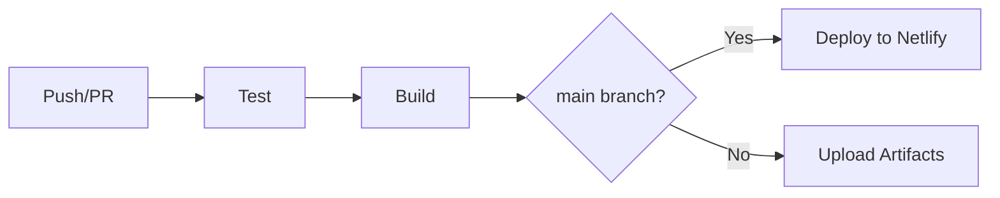

# 🚀 CI/CD 파이프라인 설정 가이드

## 구축 완료된 CI/CD 구성

### 1. **GitHub Actions** (자동 테스트 및 빌드)
- `.github/workflows/ci.yml` - 메인 CI/CD 파이프라인
- `.github/workflows/pr-check.yml` - PR 체크 자동화

### 2. **배포 플랫폼 설정**
- `netlify.toml` - Netlify 배포 설정
- `vercel.json` - Vercel 배포 설정

---

## 🎯 설정 방법

### 1단계: GitHub Repository Secrets 설정

GitHub 저장소 → Settings → Secrets and variables → Actions

**Netlify 배포를 위한 시크릿:**
```
NETLIFY_AUTH_TOKEN=<your-netlify-personal-access-token>
NETLIFY_SITE_ID=<your-netlify-site-id>
```

**Netlify 토큰 받는 방법:**
1. [Netlify](https://app.netlify.com) 로그인
2. User Settings → Applications → Personal access tokens
3. "New access token" 클릭
4. 토큰 복사

**Netlify Site ID 찾는 방법:**
1. Netlify 대시보드에서 사이트 선택
2. Site settings → General → Site information
3. API ID 복사

---

### 2단계: Netlify 연결 (무료 호스팅)

#### 방법 1: Netlify CLI 사용
```bash
# Netlify CLI 설치
npm install -g netlify-cli

# 로그인
netlify login

# 새 사이트 생성
netlify init

# 수동 배포 테스트
netlify deploy --prod --dir=dist
```

#### 방법 2: GitHub 연동 (추천)
1. [Netlify](https://app.netlify.com) 로그인
2. "Add new site" → "Import an existing project"
3. GitHub 연결 및 저장소 선택
4. 빌드 설정:
   - Build command: `npm run build:railway`
   - Publish directory: `dist`
5. "Deploy site" 클릭

---

### 3단계: Vercel 연결 (대안)

1. [Vercel](https://vercel.com) 로그인
2. "New Project" 클릭
3. GitHub 저장소 Import
4. 환경 변수 설정 (필요시)
5. "Deploy" 클릭

**Vercel CLI 사용:**
```bash
# Vercel CLI 설치
npm install -g vercel

# 배포
vercel

# 프로덕션 배포
vercel --prod
```

---

## 📊 GitHub Actions 워크플로우

### 메인 CI/CD 파이프라인 (`ci.yml`)



**실행 단계:**
1. **Test Job**
   - 의존성 설치
   - Lint 실행
   - 테스트 실행
   - 커버리지 리포트 생성

2. **Build Job**
   - 프로덕션 빌드
   - 빌드 결과물 업로드

3. **Deploy Job** (main 브랜치만)
   - Netlify로 자동 배포

### PR 체크 워크플로우 (`pr-check.yml`)
- 코드 포맷팅 검사
- ESLint 실행
- PR에 자동 코멘트

---

## 🔧 로컬에서 CI/CD 테스트

### GitHub Actions 로컬 테스트
```bash
# act 설치 (GitHub Actions 로컬 실행)
brew install act  # macOS
# 또는
curl https://raw.githubusercontent.com/nektos/act/master/install.sh | sudo bash  # Linux

# 워크플로우 실행
act push
act pull_request
```

### 빌드 테스트
```bash
# 프로덕션 빌드
npm run build:railway

# 빌드 결과 확인
ls -la dist/

# 로컬에서 프로덕션 빌드 서빙
npx serve dist
```

---

## 📝 환경 변수 설정

### 개발 환경 (`.env.development`)
```env
VUE_APP_API_URL=http://localhost:3000
VUE_APP_SUPABASE_URL=your-dev-url
VUE_APP_SUPABASE_ANON_KEY=your-dev-key
```

### 프로덕션 환경 (`.env.production`)
```env
VUE_APP_API_URL=https://api.yoursite.com
VUE_APP_SUPABASE_URL=your-prod-url
VUE_APP_SUPABASE_ANON_KEY=your-prod-key
```

**⚠️ 주의: `.env` 파일은 절대 커밋하지 마세요!**

---

## 🚦 배포 상태 배지

README.md에 추가할 배지:

```markdown


```

---

## 📋 체크리스트

### 초기 설정
- [ ] GitHub Secrets 설정 완료
- [ ] Netlify 계정 생성 및 연결
- [ ] 환경 변수 설정
- [ ] 첫 배포 성공

### 일일 운영
- [ ] main 브랜치 푸시 시 자동 배포 확인
- [ ] PR 생성 시 자동 체크 확인
- [ ] 배포 미리보기 URL 확인

### 모니터링
- [ ] GitHub Actions 탭에서 워크플로우 확인
- [ ] Netlify 대시보드에서 배포 상태 확인
- [ ] 에러 발생 시 로그 확인

---

## 🆘 트러블슈팅

### 문제: Build 실패
```bash
# 로컬에서 빌드 테스트
npm run build:railway

# 의존성 문제 해결
rm -rf node_modules package-lock.json
npm install --legacy-peer-deps
```

### 문제: Netlify 배포 실패
- Netlify 대시보드 → Deploys → 실패한 배포 클릭
- 빌드 로그 확인
- 일반적인 원인:
  - Node 버전 불일치
  - 환경 변수 누락
  - 빌드 명령 오류

### 문제: GitHub Actions 실패
- Actions 탭 → 실패한 워크플로우 클릭
- 로그 확인
- Re-run jobs 버튼으로 재실행

---

## 📚 참고 자료

- [GitHub Actions 문서](https://docs.github.com/en/actions)
- [Netlify 문서](https://docs.netlify.com/)
- [Vercel 문서](https://vercel.com/docs)
- [Vue.js 배포 가이드](https://cli.vuejs.org/guide/deployment.html)

---

## 🎉 완료!

CI/CD 파이프라인이 성공적으로 구축되었습니다!

**다음 단계:**
1. GitHub에 코드 푸시
2. Actions 탭에서 워크플로우 실행 확인
3. Netlify/Vercel에서 배포 URL 확인
4. 🚀 프로덕션 배포 완료!