# 🏗️ My Codit Manager - 시스템 아키텍처 다이어그램

> 📅 **작성일**: 2025년 7월 14일  
> 🎯 **목적**: 프로젝트 전체 구조와 데이터 흐름 시각화  
> 📊 **현재 상태**: 75% 완성 (인증 시스템 완료, 데이터 관리 부분 API 연동 필요)

---

## 🌐 **전체 시스템 아키텍처**

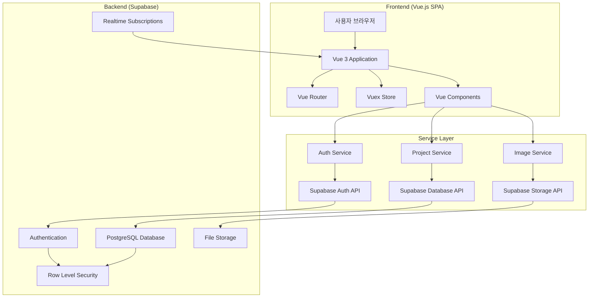

---

## 📱 **프론트엔드 아키텍처**

### 🔧 **Vue.js 컴포넌트 구조**

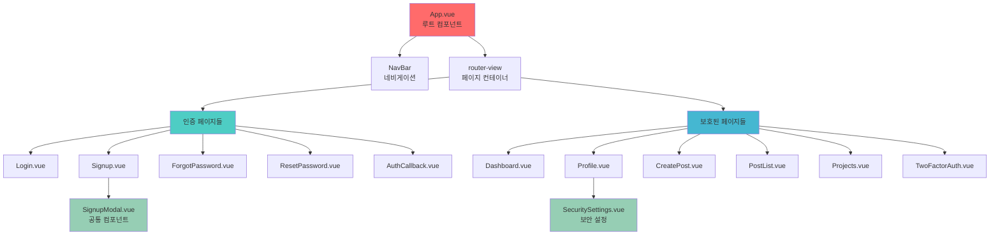

### 📊 **상태 관리 패턴**

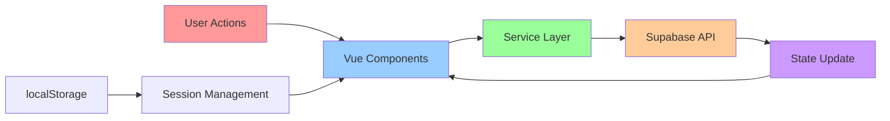

---

## 🗄️ **데이터베이스 아키텍처**

### 📋 **테이블 관계도**

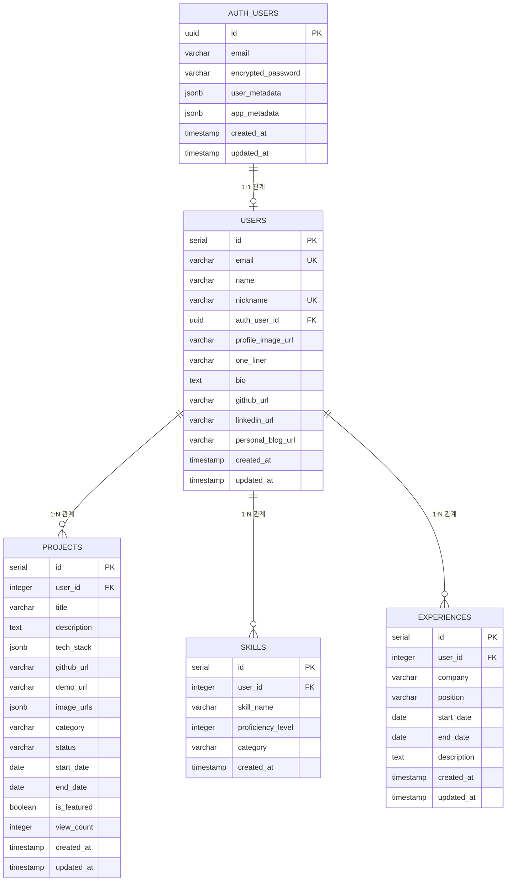

### 🔒 **Row Level Security (RLS) 정책**

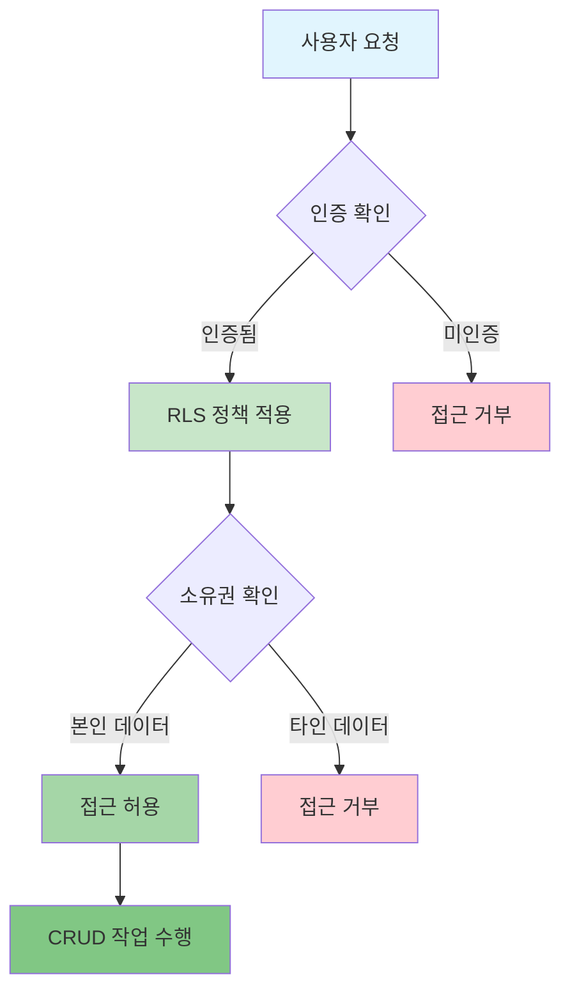

---

## 🔐 **인증 시스템 아키텍처**

### 🚪 **인증 플로우**

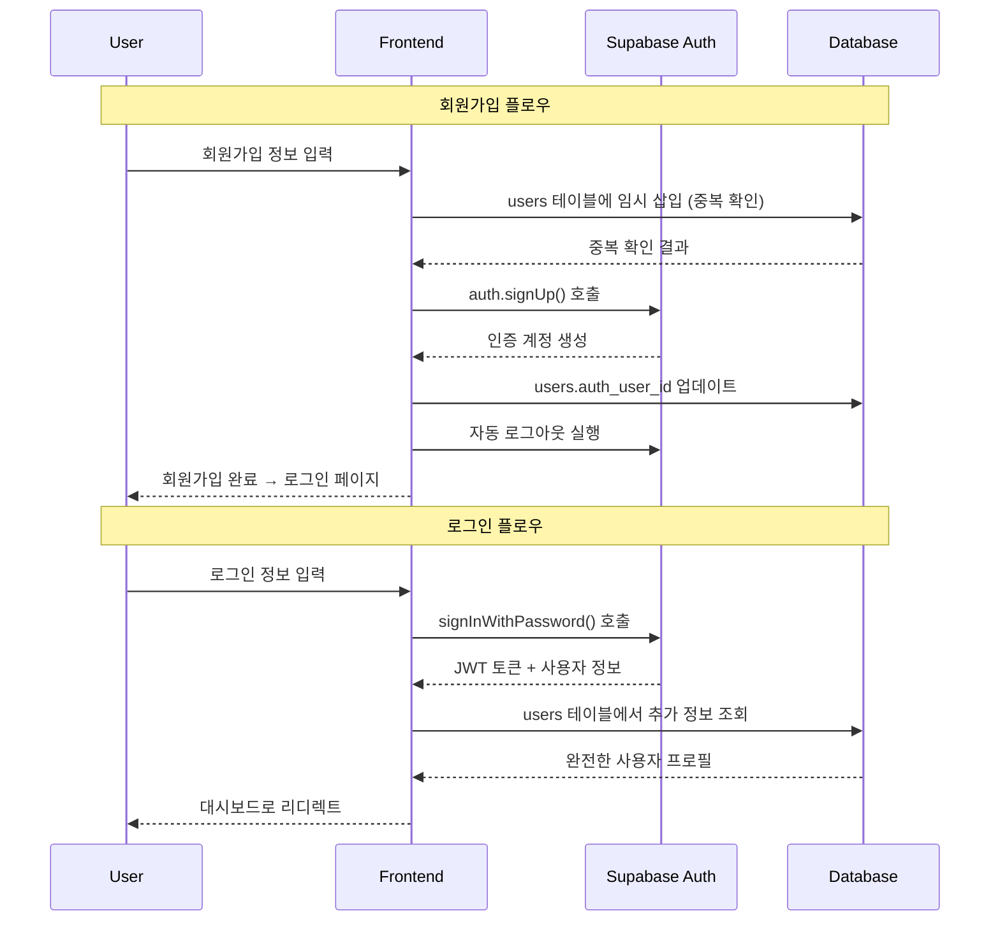

### 🔑 **소셜 로그인 플로우**

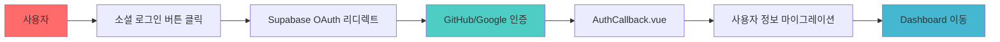

---

## 📂 **파일 시스템 아키텍처**

### 📁 **프로젝트 디렉토리 구조**

```
📦 developer-showcase-frontend/
├── 📁 public/                     # 정적 파일
│   ├── 🌐 index.html              # SPA 진입점
│   └── 🖼️ favicon.ico             # 파비콘
├── 📁 src/                        # 소스 코드
│   ├── 📁 assets/                 # 정적 리소스
│   │   ├── 🖼️ github.png
│   │   ├── 🖼️ google.png
│   │   └── 🖼️ logo.png
│   ├── 📁 components/             # 재사용 컴포넌트
│   │   ├── ✅ SignupModal.vue
│   │   ├── ✅ SecuritySettings.vue
│   │   └── ❌ NavBar.vue (미사용)
│   ├── 📁 views/                  # 페이지 컴포넌트
│   │   ├── ✅ Login.vue           # 로그인 (완성)
│   │   ├── ✅ Signup.vue          # 회원가입 (완성)
│   │   ├── ✅ ForgotPassword.vue  # 비밀번호 찾기 (완성)
│   │   ├── ✅ ResetPassword.vue   # 비밀번호 재설정 (완성)
│   │   ├── ✅ AuthCallback.vue    # OAuth 콜백 (완성)
│   │   ├── 🔄 Dashboard.vue       # 대시보드 (API 연동 필요)
│   │   ├── 🔄 Profile.vue         # 프로필 (API 연동 필요)
│   │   ├── 🔄 CreatePost.vue      # 프로젝트 추가 (API 연동 필요)
│   │   ├── 🔄 PostList.vue        # 프로젝트 목록 (API 연동 필요)
│   │   ├── 🔄 TwoFactorAuth.vue   # 2FA (로직 구현 필요)
│   │   └── 📋 Projects.vue        # Coming Soon
│   ├── 📁 config/                 # 설정 파일
│   │   ├── ✅ supabase.js         # Supabase 설정
│   │   ├── ✅ environment.js      # 환경변수
│   │   └── ✅ auth.js             # 인증 설정
│   ├── 📁 services/               # API 서비스
│   │   ├── ✅ authService.js      # 인증 API (완성)
│   │   ├── 🔄 projectService.js   # 프로젝트 API (구현 필요)
│   │   └── 🔄 imageService.js     # 이미지 API (구현 필요)
│   ├── 📁 router/                 # 라우팅
│   │   └── ✅ index.js            # 라우트 설정 (완성)
│   ├── 📁 store/                  # 상태 관리 (향후 확장)
│   │   └── ✅ index.js            # Vuex 스토어
│   ├── ✅ App.vue                 # 루트 컴포넌트
│   └── ✅ main.js                 # 앱 진입점
├── 📄 package.json                # 의존성 관리
├── 📄 vue.config.js               # Vue CLI 설정
├── 📄 Dockerfile                  # Docker 배포
└── 📁 docs/                       # 프로젝트 문서
    ├── 📄 PROJECT_OVERVIEW.md
    ├── 📄 PROJECT_ARCHITECTURE.md
    ├── 📄 CURRENT_PROJECT_STATUS.md
    ├── 📄 TESTING_GUIDE.md
    ├── 📄 DEVELOPMENT_ROADMAP.md
    └── 📄 PROJECT_ARCHITECTURE_DIAGRAM.md (이 문서)
```

---

## 🌊 **데이터 플로우 아키텍처**

### 📊 **전체 데이터 흐름**

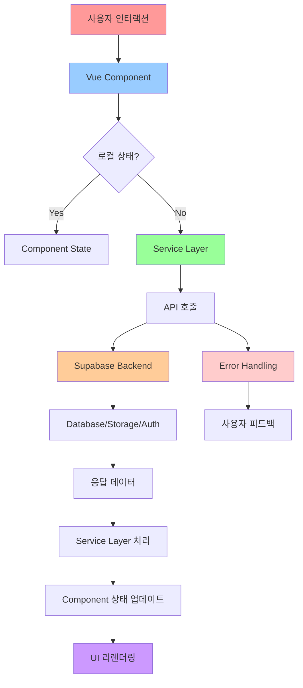

### 🔄 **실시간 데이터 동기화**

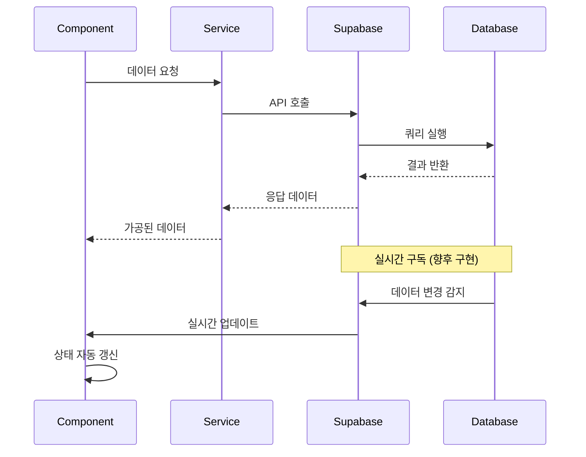

---

## 🔗 **API 아키텍처**

### 🛠️ **서비스 계층 구조**

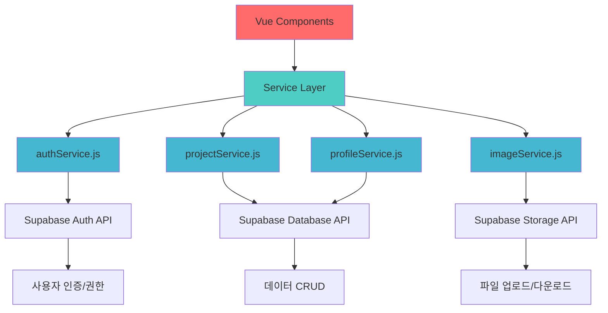

### 📡 **API 엔드포인트 매핑**

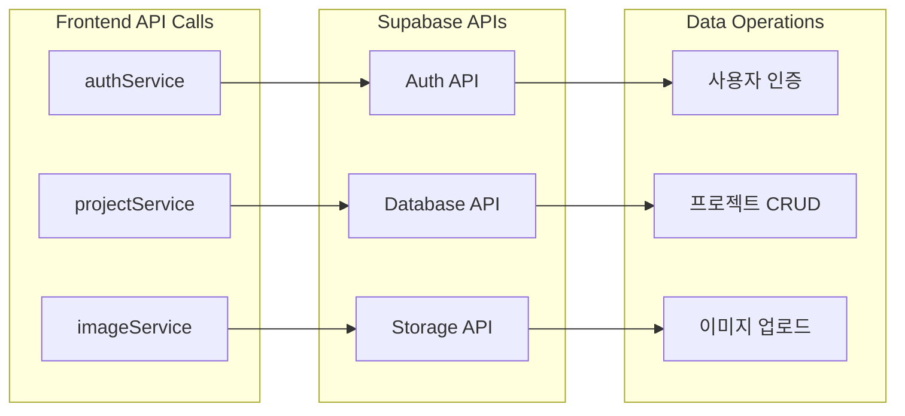

---

## 🚀 **배포 아키텍처**

### 🐳 **Docker 컨테이너 구조**

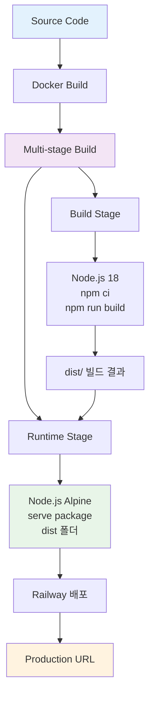

### 🌐 **배포 환경 구성**

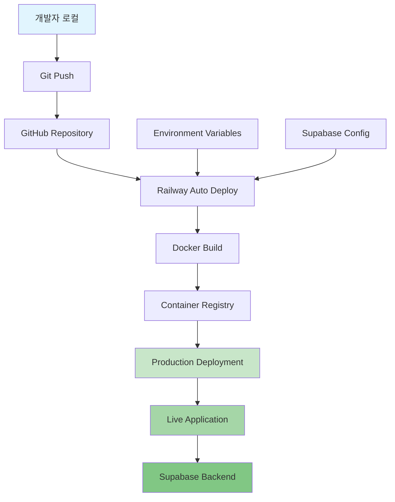

---

## 🔒 **보안 아키텍처**

### 🛡️ **보안 계층 구조**

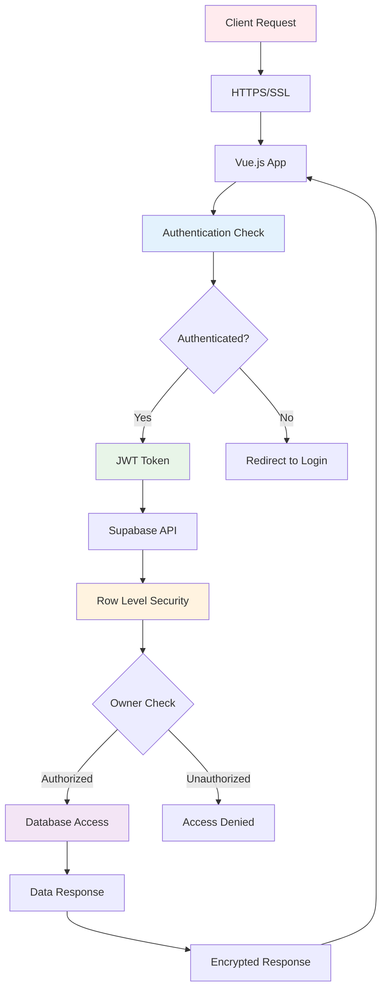

### 🔐 **인증 토큰 흐름**

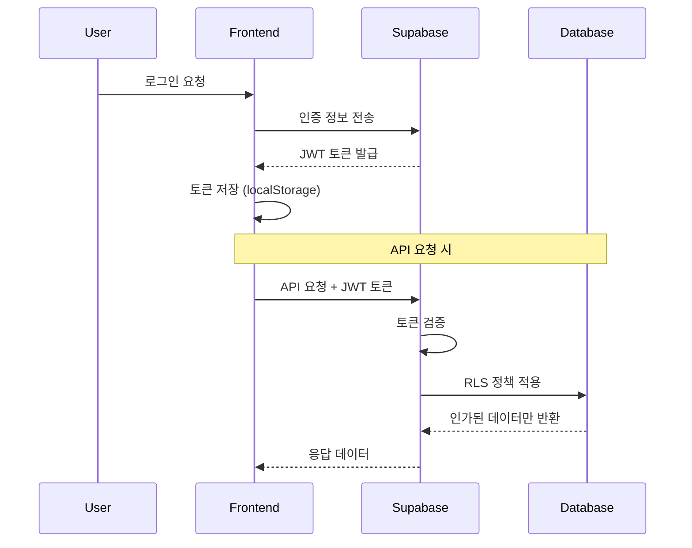

---

## 📊 **성능 아키텍처**

### ⚡ **최적화 전략**

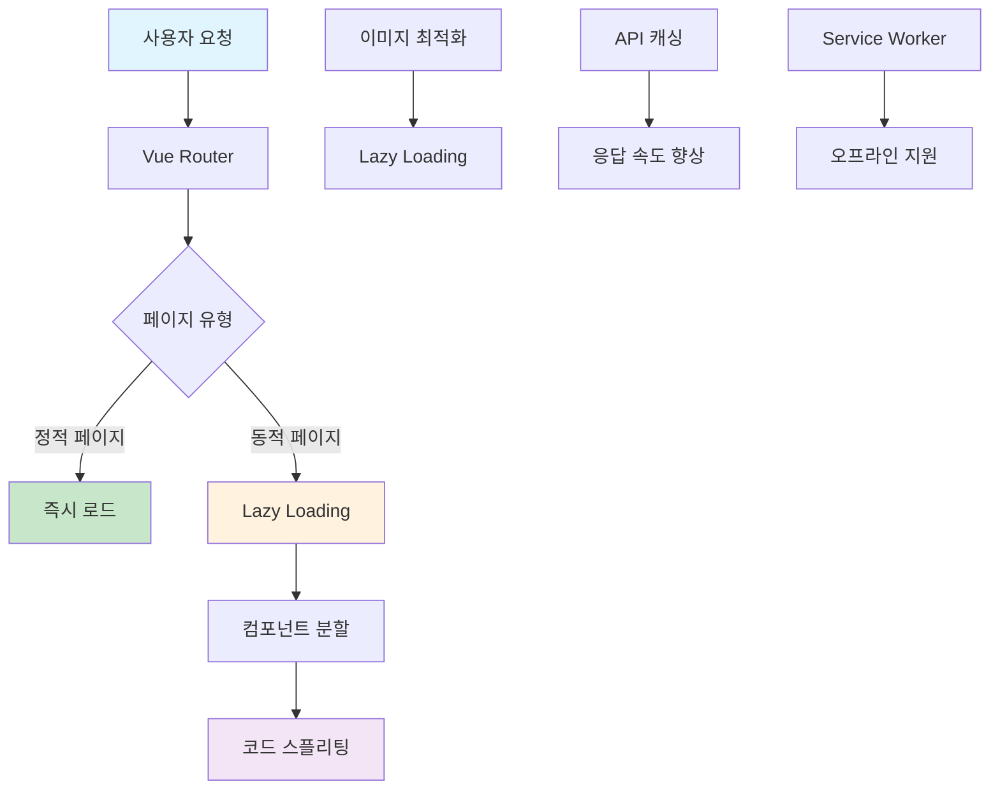

### 📈 **로딩 성능 최적화**

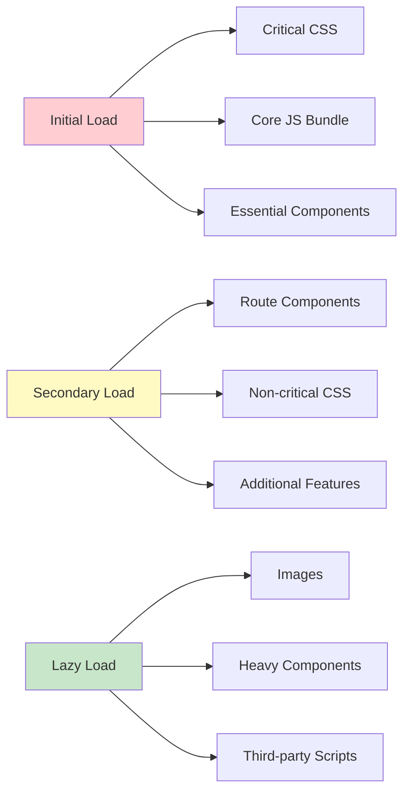

---

## 🎯 **현재 구현 상태 시각화**

### 📊 **기능별 완성도**

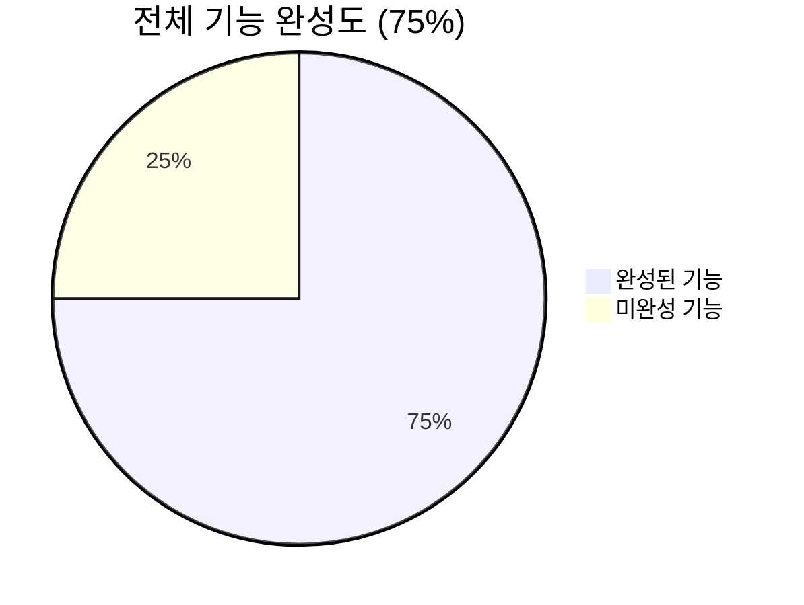

### 🔄 **컴포넌트별 상태**

```mermaid
graph TD
    A[전체 컴포넌트] --> B[완성 ✅]
    A --> C[부분 완성 🔄]
    A --> D[미구현 ❌]
    
    B --> B1[Login.vue]
    B --> B2[Signup.vue]
    B --> B3[ForgotPassword.vue]
    B --> B4[ResetPassword.vue]
    B --> B5[AuthCallback.vue]
    B --> B6[App.vue]
    B --> B7[SignupModal.vue]
    B --> B8[SecuritySettings.vue]
    
    C --> C1[Dashboard.vue - UI완성, API연동필요]
    C --> C2[Profile.vue - UI완성, API연동필요]
    C --> C3[CreatePost.vue - UI완성, API연동필요]
    C --> C4[PostList.vue - UI완성, API연동필요]
    C --> C5[TwoFactorAuth.vue - UI완성, 로직필요]
    
    D --> D1[Projects.vue - Coming Soon]
    D --> D2[projectService.js - 미구현]
    D --> D3[imageService.js - 미구현]
    
    style B fill:#c8e6c9
    style C fill:#fff3e0
    style D fill:#ffcdd2
```

---

## 🚀 **향후 확장 아키텍처**

### 🔮 **예정된 기능 확장**

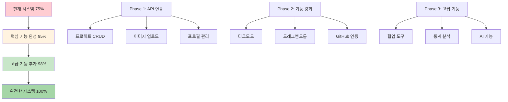

---

## 📋 **아키텍처 체크리스트**

### ✅ **현재 완성된 아키텍처**
- [x] Vue.js SPA 기본 구조
- [x] 컴포넌트 기반 아키텍처
- [x] Vue Router 라우팅 시스템
- [x] Supabase 인증 시스템
- [x] Row Level Security 적용
- [x] 반응형 UI 아키텍처
- [x] 모바일 우선 디자인
- [x] Docker 기반 배포 구조

### 🔄 **구현 중인 아키텍처**
- [ ] 완전한 API 서비스 계층
- [ ] 이미지 업로드 아키텍처
- [ ] 실시간 데이터 동기화
- [ ] 성능 최적화 구조

### 🎯 **향후 구현 예정**
- [ ] 상태 관리 아키텍처 (Vuex 활용)
- [ ] 캐싱 전략 구현
- [ ] 오프라인 지원 아키텍처
- [ ] 마이크로서비스 확장 구조

---

*📅 최종 업데이트: 2025년 7월 14일*  
*🏗️ 아키텍처 버전: v1.0*  
*📊 현재 완성도: 75%*  
*🎯 목표: 완전한 포트폴리오 관리 시스템 아키텍처*